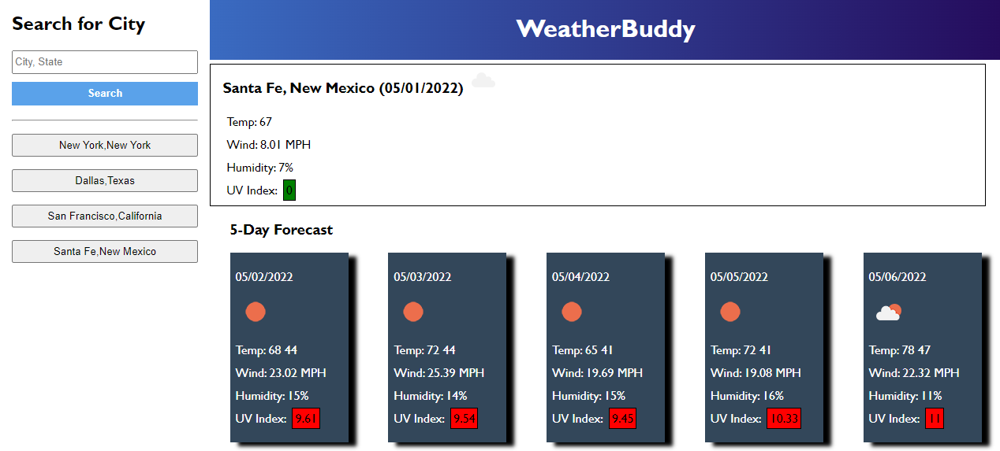
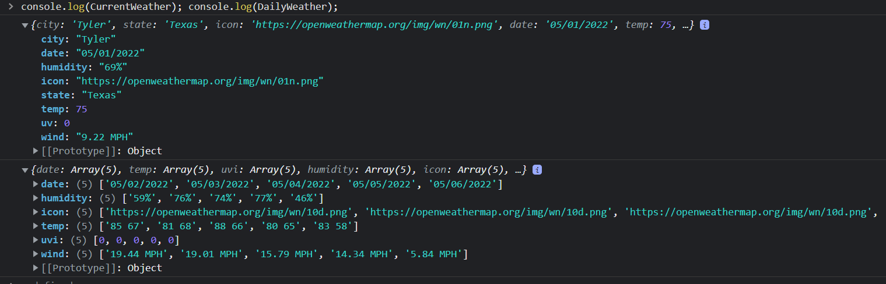

# WeatherBuddy
## Introduction

WeatherBuddy is an application that reports current weather and also gives a 5-day forecast for US cities. It gets its information from OpenWeather API. Current weather is at the top of the page, and the forecast is beneath that. Eight of the past searches will be recorded on the left side as buttons. This is an assignment from the UT Austin coding boot camp.

## Technologies
<li>HTML5
<li>JavaScript 1.7
<li>moment.js 2.24
<li>JQuery 3.4.1

## Links

<li>Application: https://phaberle.github.io/WeatherBuddy/
<li>Repository : https://github.com/phaberle/WeatherBuddy

## Instructions

<ol>
<li> User types in name of city and state separated by comma.
<li> A history button is created on the fly to the left after information has been received from the OpenWeather API.
<li> User may press a history button to go to a previous search. 
</ol>

## Design

The API information needed for this application was cherry picked using several functions. I made two custom objects - one to hold current weather and the other to hold daily 5-day forecast weather. Some of the properties required adding text. For example, for the wind I added MPH, or I combined high and low temps for the daily weather. The UV index color coding read API UV index values and evaluated them for the correct color.  From using the custom data objects, I then templated the data into DOM elements using JavaScript. The data objects at the beginning of each new search are cleared . Without this, the results would just keep growing and growing making the page unnecessarily large. 

